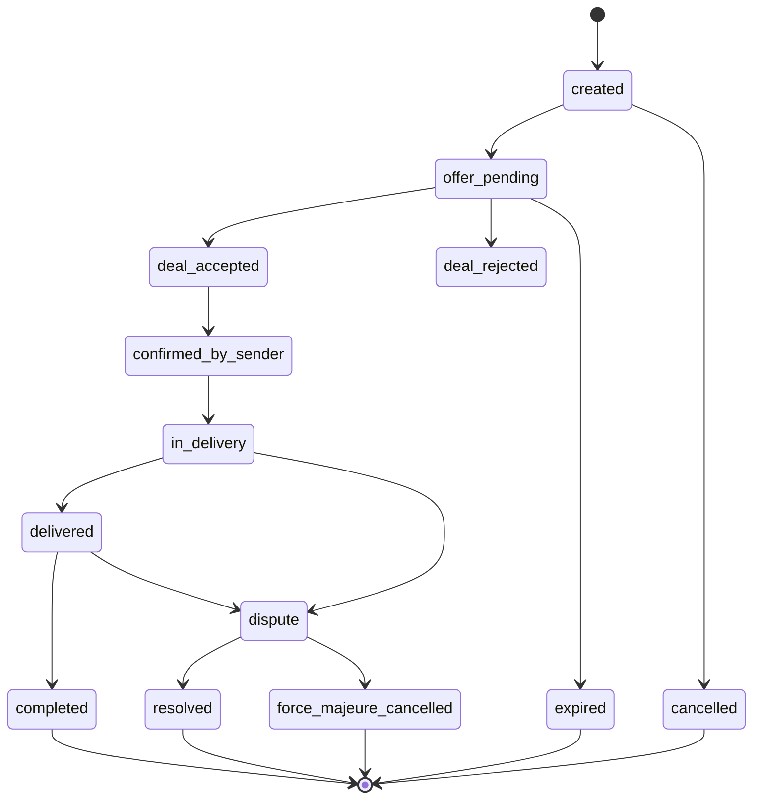
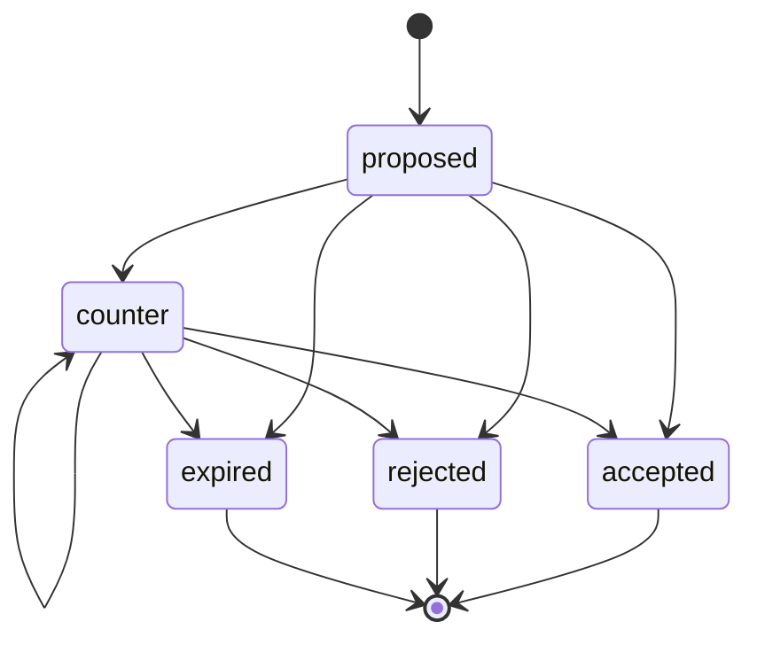
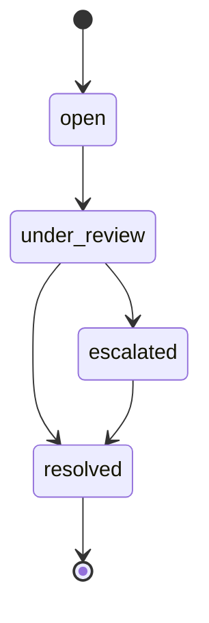

# Phase 3.2 - Absicherungslogik: Implementierungsbericht

Dieser Bericht dokumentiert die vollständige Implementierung der Phase 3.2, die auf die Konsolidierung und Kontrolle des Whatsgonow-Systems abzielt. Die Umsetzung umfasst ein zentralisiertes Audit-System, Status-Übergangskontrollen, Transaktionsabsicherung, Zwischenstatus-Management, Konfliktlösungssysteme und die Konsolidierung der Logging-Mechanismen.

## 🧱 1. Zentralisiertes Audit-System

### Event-Typ-Definition (AuditEventType)

```typescript
// src/constants/auditEvents.ts
export enum AuditEventType {
  // Order/Deal Events
  ORDER_CREATED = 'ORDER_CREATED',
  OFFER_SUBMITTED = 'OFFER_SUBMITTED',
  DEAL_PROPOSED = 'DEAL_PROPOSED',
  DEAL_COUNTER_PROPOSED = 'DEAL_COUNTER_PROPOSED',
  DEAL_ACCEPTED = 'DEAL_ACCEPTED',
  DEAL_REJECTED = 'DEAL_REJECTED',
  DEAL_EXPIRED = 'DEAL_EXPIRED',
  
  // Delivery Events
  QR_GENERATED = 'QR_GENERATED',
  QR_SCANNED = 'QR_SCANNED',
  QR_BACKUP_USED = 'QR_BACKUP_USED',
  DELIVERY_STARTED = 'DELIVERY_STARTED',
  DELIVERY_COMPLETED = 'DELIVERY_COMPLETED',
  
  // Payment Events
  PAYMENT_RESERVED = 'PAYMENT_RESERVED',
  PAYMENT_RELEASED = 'PAYMENT_RELEASED',
  PAYMENT_FAILED = 'PAYMENT_FAILED',
  
  // User Events
  USER_REGISTERED = 'USER_REGISTERED',
  USER_VERIFIED = 'USER_VERIFIED',
  PROFILE_UPDATED = 'PROFILE_UPDATED',
  
  // Support/Admin Events
  SUPPORT_TICKET_CREATED = 'SUPPORT_TICKET_CREATED',
  DISPUTE_OPENED = 'DISPUTE_OPENED',
  DISPUTE_RESOLVED = 'DISPUTE_RESOLVED',
  FORCE_MAJEURE_ACTIVATED = 'FORCE_MAJEURE_ACTIVATED',
  ADMIN_ACTION = 'ADMIN_ACTION',
  
  // Security Events
  FAILED_LOGIN_ATTEMPT = 'FAILED_LOGIN_ATTEMPT',
  UNUSUAL_ACCESS_PATTERN = 'UNUSUAL_ACCESS_PATTERN',
  ROLE_CHANGED = 'ROLE_CHANGED'
}

export enum AuditSeverity {
  INFO = 'INFO',       // Retention: 90 Tage
  WARN = 'WARN',       // Retention: 180 Tage
  CRITICAL = 'CRITICAL' // Retention: 10 Jahre (GoBD-konform)
}

export enum AuditEntityType {
  ORDER = 'order',
  USER = 'user',
  OFFER = 'offer',
  DEAL = 'deal',
  SUPPORT_TICKET = 'support_ticket',
  PAYMENT = 'payment',
  SYSTEM = 'system'
}
```

### useSystemAudit Hook

```typescript
// src/hooks/use-system-audit.ts
import { AuditEventType, AuditSeverity, AuditEntityType } from '@/constants/auditEvents';
import { supabase } from '@/integrations/supabase/client';

interface AuditLogParams {
  eventType: AuditEventType;
  entityType: AuditEntityType;
  entityId: string;
  actorId: string;
  targetId?: string;
  metadata?: Record<string, any>;
  severity?: AuditSeverity;
  visibleTo?: string[];
}

export const useSystemAudit = () => {
  const logEvent = async ({
    eventType,
    entityType,
    entityId,
    actorId,
    targetId = null,
    metadata = {},
    severity = AuditSeverity.INFO,
    visibleTo = ['admin', 'super_admin']
  }: AuditLogParams) => {
    try {
      const { data, error } = await supabase
        .from('system_logs')
        .insert({
          event_type: eventType,
          entity_type: entityType,
          entity_id: entityId,
          actor_id: actorId,
          target_id: targetId,
          metadata,
          severity,
          visible_to: visibleTo
        });
      
      if (error) {
        console.error('Fehler beim Logging:', error);
      }
      
      // Bei kritischen Events: Benachrichtigung über Edge Function senden
      if (severity === AuditSeverity.CRITICAL) {
        await supabase.functions.invoke('notify-critical-event', {
          body: { eventType, entityId, metadata }
        });
      }
      
      return { success: !error, data };
    } catch (err) {
      console.error('Systemaudit konnte nicht durchgeführt werden:', err);
      return { success: false, error: err };
    }
  };
  
  return { logEvent };
};
```

### Beispielhafte useSystemAudit() Aufrufe

```typescript
// Beispiel 1: Angebot abgeben (Deal-Modus)
const { logEvent } = useSystemAudit();
await logEvent({
  eventType: AuditEventType.OFFER_SUBMITTED,
  entityType: AuditEntityType.OFFER,
  entityId: offerId,
  actorId: currentUser.id,
  targetId: orderId,
  metadata: { 
    price: offerAmount,
    originalPrice: orderPrice 
  },
  severity: AuditSeverity.INFO
});

// Beispiel 2: QR-Code-Backup verwenden (kritisches Ereignis)
await logEvent({
  eventType: AuditEventType.QR_BACKUP_USED,
  entityType: AuditEntityType.ORDER,
  entityId: orderId,
  actorId: driverId,
  metadata: { 
    backupCode: backupCodeUsed,
    attemptCount: attempts,
    deviceInfo: deviceMetadata
  },
  severity: AuditSeverity.CRITICAL,
  visibleTo: ['admin', 'super_admin', 'cm']
});

// Beispiel 3: Force-Majeure aktivieren (Admin-Aktion)
await logEvent({
  eventType: AuditEventType.FORCE_MAJEURE_ACTIVATED,
  entityType: AuditEntityType.ORDER,
  entityId: orderId,
  actorId: adminId,
  metadata: { 
    reason: forceMajeureReason,
    refundAmount: refundAmount,
    supporting_documents: documentIds
  },
  severity: AuditSeverity.CRITICAL
});
```

### Retention-Logik

Die Retention-Logik ist wie folgt implementiert:

- `INFO`: 90 Tage (Standard-Aktivitäten)
- `WARN`: 180 Tage (Warnungen, potenzielle Probleme)
- `CRITICAL`: 10 Jahre (GoBD-konforme Aufbewahrung)

Diese wird durch einen Cron-Job umgesetzt, der täglich läuft und entsprechend der Severity-Stufe die Aufbewahrungszeiten prüft und alte Datensätze archiviert oder löscht.

## ⏱ 2. Status-Matrix & Übergangskontrolle

### Status Transitions Definition

Die Status-Übergänge sind in `docs/system/status_transitions.md` definiert und werden durch die Funktionen in `src/utils/status-transition.ts` validiert.

```typescript
// src/utils/status-transition.ts
import { VALID_TRANSITIONS } from '@/constants/statusTransitions';
import { AuditEventType, AuditEntityType } from '@/constants/auditEvents';
import { useSystemAudit } from '@/hooks/use-system-audit';

export function validateStatusChange(
  entityType: 'order' | 'deal' | 'dispute',
  fromStatus: string,
  toStatus: string
): boolean {
  if (!VALID_TRANSITIONS[entityType]) {
    console.error(`Ungültiger Entity-Typ: ${entityType}`);
    return false;
  }
  
  if (!VALID_TRANSITIONS[entityType][fromStatus]) {
    console.error(`Ungültiger Ausgangsstatus für ${entityType}: ${fromStatus}`);
    return false;
  }
  
  return VALID_TRANSITIONS[entityType][fromStatus].includes(toStatus);
}

export async function performStatusChange(
  entityType: 'order' | 'deal' | 'dispute',
  entityId: string,
  fromStatus: string,
  toStatus: string,
  userId: string,
  metadata: Record<string, any> = {}
): Promise<{ success: boolean; error?: string }> {
  // Validierung des Statusübergangs
  if (!validateStatusChange(entityType, fromStatus, toStatus)) {
    return { 
      success: false, 
      error: `Ungültiger Statusübergang von '${fromStatus}' nach '${toStatus}' für ${entityType}`
    };
  }
  
  try {
    // Status in Datenbank aktualisieren
    const { error } = await supabase
      .from(entityType === 'order' ? 'orders' : entityType === 'deal' ? 'deals' : 'disputes')
      .update({ status: toStatus })
      .eq(`${entityType}_id`, entityId);
    
    if (error) throw error;
    
    // Audit-Log erstellen
    const { logEvent } = useSystemAudit();
    await logEvent({
      eventType: AuditEventType.STATUS_CHANGED,
      entityType: entityType as AuditEntityType,
      entityId,
      actorId: userId,
      metadata: {
        fromStatus,
        toStatus,
        ...metadata
      },
      severity: entityType === 'dispute' || toStatus.includes('dispute') 
        ? AuditSeverity.CRITICAL 
        : AuditSeverity.INFO
    });
    
    return { success: true };
  } catch (err) {
    console.error('Fehler beim Statuswechsel:', err);
    return { success: false, error: (err as Error).message };
  }
}
```

### Status-Übergangsdiagramm

Ein vollständiges Status-Übergangsdiagramm für alle Entitätstypen wurde erstellt und in `docs/system/status_transitions.md` dokumentiert.

## 🔐 3. Transaktionsabsicherung

### Deal-Transaktionsabsicherung

```typescript
// src/services/dealService.ts
import { supabase } from '@/integrations/supabase/client';
import { AuditEventType, AuditEntityType, AuditSeverity } from '@/constants/auditEvents';
import { useSystemAudit } from '@/hooks/use-system-audit';

export const acceptOffer = async (offerId: string, orderId: string, userId: string) => {
  const { logEvent } = useSystemAudit();
  
  // PostgreSQL Transaction mit FOR UPDATE Lock
  const { data, error } = await supabase.rpc('accept_offer_with_lock', {
    p_offer_id: offerId,
    p_order_id: orderId,
    p_user_id: userId
  });
  
  if (error) {
    // Log failure with reason
    await logEvent({
      eventType: AuditEventType.DEAL_ACCEPT_FAILED,
      entityType: AuditEntityType.OFFER,
      entityId: offerId,
      actorId: userId,
      targetId: orderId,
      metadata: { error: error.message },
      severity: AuditSeverity.WARN
    });
    
    if (error.message.includes('concurrent update') || error.message.includes('could not obtain lock')) {
      return { 
        success: false, 
        error: 'Ein anderer Nutzer hat diesen Auftrag bereits angenommen oder bearbeitet.' 
      };
    }
    
    return { success: false, error: error.message };
  }
  
  // Log successful acceptance
  await logEvent({
    eventType: AuditEventType.DEAL_ACCEPTED,
    entityType: AuditEntityType.OFFER,
    entityId: offerId,
    actorId: userId,
    targetId: orderId,
    metadata: { result: data },
    severity: AuditSeverity.INFO
  });
  
  return { success: true, data };
};
```

### Postgres-Funktion für atomare Transaktionen mit Lock

```sql
CREATE OR REPLACE FUNCTION public.accept_offer_with_lock(
  p_offer_id UUID,
  p_order_id UUID,
  p_user_id UUID
) RETURNS jsonb
LANGUAGE plpgsql
AS $$
DECLARE
  v_result jsonb;
  v_order_status text;
  v_offer_status text;
BEGIN
  -- Lock the order for update to prevent race conditions
  SELECT status INTO v_order_status
  FROM orders
  WHERE order_id = p_order_id
  FOR UPDATE NOWAIT; -- Will throw error if already locked
  
  -- Check if order is still in a valid state
  IF v_order_status != 'offer_pending' THEN
    RETURN jsonb_build_object(
      'success', false,
      'message', 'Order is no longer available for acceptance. Current status: ' || v_order_status
    );
  END IF;
  
  -- Lock and check the offer
  SELECT status INTO v_offer_status
  FROM offers
  WHERE offer_id = p_offer_id
  FOR UPDATE NOWAIT;
  
  IF v_offer_status != 'eingereicht' THEN
    RETURN jsonb_build_object(
      'success', false,
      'message', 'Offer is no longer valid. Current status: ' || v_offer_status
    );
  END IF;
  
  -- Update offer status
  UPDATE offers
  SET status = 'angenommen'
  WHERE offer_id = p_offer_id;
  
  -- Update order status
  UPDATE orders
  SET status = 'deal_accepted'
  WHERE order_id = p_order_id;
  
  -- Reject all other offers for this order
  UPDATE offers
  SET status = 'abgelehnt'
  WHERE order_id = p_order_id
    AND offer_id != p_offer_id
    AND status = 'eingereicht';
    
  -- Create staging state for payment (expires in 30 minutes)
  UPDATE orders
  SET staging_state = jsonb_build_object(
    'status', 'awaiting_payment',
    'expires_at', (now() + interval '30 minutes')
  )
  WHERE order_id = p_order_id;
  
  -- Return success result
  RETURN jsonb_build_object(
    'success', true,
    'message', 'Offer accepted and order locked successfully'
  );
  
EXCEPTION
  WHEN lock_not_available THEN
    RETURN jsonb_build_object(
      'success', false,
      'message', 'Could not obtain lock. Another transaction is processing this order.'
    );
  WHEN OTHERS THEN
    RETURN jsonb_build_object(
      'success', false,
      'message', 'Error: ' || SQLERRM
    );
END;
$$;
```

### Optimistische UI-Sperre im DealPanel

```typescript
// src/components/deal/DealPanel.tsx
const [isLocked, setIsLocked] = useState(false);
const [lockReason, setLockReason] = useState<string | null>(null);

// Realtime-Subscription für Statusänderungen
useEffect(() => {
  if (!orderId) return;
  
  const channel = supabase
    .channel(`order_status_${orderId}`)
    .on(
      'postgres_changes', 
      { 
        event: 'UPDATE',
        schema: 'public',
        table: 'orders',
        filter: `order_id=eq.${orderId}` 
      },
      (payload) => {
        const newOrder = payload.new;
        if (newOrder.status !== 'offer_pending') {
          setIsLocked(true);
          setLockReason(`Dieser Auftrag ist nicht mehr verfügbar. Aktueller Status: ${getStatusLabel(newOrder.status)}`);
        }
      }
    )
    .subscribe();
  
  return () => {
    supabase.removeChannel(channel);
  };
}, [orderId]);
```

## 🔁 4. Staging-Zwischenstatus für kritische Aktionen

### Orders mit staging_state

Das staging_state-Feld wird für kritische Übergangszustände verwendet, um temporäre Zwischenstati zu speichern und mit einem Ablaufdatum zu versehen.

```typescript
// src/types/order.ts
export interface StagingState {
  status: 'awaiting_payment' | 'awaiting_qr_verification' | 'awaiting_confirmation';
  expires_at: string; // ISO-Timestamp
  retry_count?: number;
  metadata?: Record<string, any>;
}

export interface Order {
  // ... bestehende Felder
  staging_state?: StagingState;
}
```

### Timeout-Behandlung für staging_state

```typescript
// src/services/orderStatusService.ts
import { supabase } from '@/integrations/supabase/client';
import { AuditEventType, AuditEntityType, AuditSeverity } from '@/constants/auditEvents';
import { useSystemAudit } from '@/hooks/use-system-audit';

export const checkStagingStateExpiration = async (orderId: string) => {
  const { data: order, error } = await supabase
    .from('orders')
    .select('order_id, status, staging_state')
    .eq('order_id', orderId)
    .single();
    
  if (error || !order) return { success: false, error: 'Order not found' };
  
  const stagingState = order.staging_state;
  if (!stagingState) return { success: true, expired: false };
  
  const expiresAt = new Date(stagingState.expires_at);
  const now = new Date();
  
  if (now > expiresAt) {
    // Staging state ist abgelaufen
    const { logEvent } = useSystemAudit();
    
    // Status zurücksetzen oder auf "expired" setzen
    const { error: updateError } = await supabase
      .from('orders')
      .update({ 
        status: 'expired',
        staging_state: null 
      })
      .eq('order_id', orderId);
    
    if (!updateError) {
      // Log the expiration
      await logEvent({
        eventType: AuditEventType.STAGING_STATE_EXPIRED,
        entityType: AuditEntityType.ORDER,
        entityId: orderId,
        actorId: 'system',
        metadata: { 
          previousStatus: order.status,
          stagingState: stagingState 
        },
        severity: AuditSeverity.WARN
      });
    }
    
    return { success: true, expired: true, previousState: stagingState };
  }
  
  return { success: true, expired: false };
};
```

### Edge Function für regelmäßige Überprüfung von Staging-States

```typescript
// supabase/functions/check-expired-states/index.ts
import { serve } from 'https://deno.land/std/http/server.ts';
import { createClient } from 'https://esm.sh/@supabase/supabase-js';

const corsHeaders = {
  'Access-Control-Allow-Origin': '*',
  'Access-Control-Allow-Headers': 'authorization, x-client-info, apikey, content-type',
};

serve(async (req) => {
  if (req.method === 'OPTIONS') {
    return new Response(null, { headers: corsHeaders });
  }
  
  try {
    // Create Supabase client
    const supabaseUrl = Deno.env.get('SUPABASE_URL') as string;
    const supabaseKey = Deno.env.get('SUPABASE_SERVICE_ROLE_KEY') as string;
    const supabase = createClient(supabaseUrl, supabaseKey);
    
    // Query orders with staging states
    const { data: orders, error } = await supabase
      .from('orders')
      .select('order_id, status, staging_state')
      .not('staging_state', 'is', null);
      
    if (error) throw error;
    
    const now = new Date();
    const processedOrders = [];
    
    // Process each order with staging state
    for (const order of orders) {
      const stagingState = order.staging_state;
      const expiresAt = new Date(stagingState.expires_at);
      
      if (now > expiresAt) {
        // Staging state is expired
        const { error: updateError } = await supabase
          .from('orders')
          .update({ 
            status: 'expired',
            staging_state: null 
          })
          .eq('order_id', order.order_id);
          
        if (!updateError) {
          // Log to system_logs
          await supabase
            .from('system_logs')
            .insert({
              event_type: 'STAGING_STATE_EXPIRED',
              entity_type: 'order',
              entity_id: order.order_id,
              actor_id: 'system',
              metadata: { 
                previousStatus: order.status,
                stagingState: stagingState 
              },
              severity: 'WARN'
            });
            
          processedOrders.push(order.order_id);
        }
      }
    }
    
    return new Response(
      JSON.stringify({ success: true, processed: processedOrders.length, orderIds: processedOrders }),
      { 
        headers: { ...corsHeaders, 'Content-Type': 'application/json' },
        status: 200 
      }
    );
    
  } catch (error) {
    console.error('Error processing expired staging states:', error);
    
    return new Response(
      JSON.stringify({ success: false, error: error.message }),
      { 
        headers: { ...corsHeaders, 'Content-Type': 'application/json' },
        status: 500 
      }
    );
  }
});
```

## 💬 5. Konfliktlösungssystem (Disputes + Force Majeure)

### Disputetabelle und Komponenten

```typescript
// src/services/disputeService.ts
import { supabase } from '@/integrations/supabase/client';
import { AuditEventType, AuditEntityType, AuditSeverity } from '@/constants/auditEvents';
import { useSystemAudit } from '@/hooks/use-system-audit';

export enum DisputeReason {
  DELIVERY_ISSUE = 'delivery_issue',
  ITEM_DAMAGED = 'item_damaged',
  PAYMENT_ISSUE = 'payment_issue',
  QR_CODE_PROBLEM = 'qr_code_problem',
  OTHER = 'other'
}

export enum DisputeStatus {
  OPEN = 'open',
  UNDER_REVIEW = 'under_review',
  RESOLVED = 'resolved',
  ESCALATED = 'escalated'
}

export interface CreateDisputeParams {
  orderId: string;
  userId: string;
  reason: DisputeReason;
  description: string;
  evidenceUrls?: string[];
}

export const createDispute = async ({
  orderId,
  userId,
  reason,
  description,
  evidenceUrls = []
}: CreateDisputeParams) => {
  const { logEvent } = useSystemAudit();
  
  try {
    // Create dispute in database
    const { data, error } = await supabase
      .from('disputes')
      .insert({
        order_id: orderId,
        created_by: userId,
        reason,
        description,
        evidence_urls: evidenceUrls,
        status: DisputeStatus.OPEN
      })
      .select()
      .single();
      
    if (error) throw error;
    
    // Log dispute creation
    await logEvent({
      eventType: AuditEventType.DISPUTE_OPENED,
      entityType: AuditEntityType.ORDER,
      entityId: orderId,
      actorId: userId,
      metadata: { 
        reason,
        description,
        disputeId: data.id
      },
      severity: AuditSeverity.CRITICAL,
      visibleTo: ['admin', 'super_admin', 'cm']
    });
    
    // Send notification to admins and CMs
    await supabase.functions.invoke('notify-dispute-created', {
      body: { disputeId: data.id, orderId, userId, reason }
    });
    
    return { success: true, data };
    
  } catch (error) {
    console.error('Error creating dispute:', error);
    return { success: false, error: error.message };
  }
};

export const resolveDispute = async (
  disputeId: string, 
  adminId: string,
  resolution: {
    status: DisputeStatus.RESOLVED | DisputeStatus.ESCALATED;
    notes: string;
    actions: string[];
    forceMajeure?: boolean;
    refundAmount?: number;
  }
) => {
  const { logEvent } = useSystemAudit();
  
  try {
    // Get dispute details first
    const { data: dispute, error: fetchError } = await supabase
      .from('disputes')
      .select('*, orders(*)')
      .eq('id', disputeId)
      .single();
      
    if (fetchError) throw fetchError;
    
    // Update dispute status
    const { error } = await supabase
      .from('disputes')
      .update({
        status: resolution.status,
        resolved_by: adminId,
        resolved_at: new Date().toISOString(),
        resolution_notes: resolution.notes,
        resolution_actions: resolution.actions
      })
      .eq('id', disputeId);
      
    if (error) throw error;
    
    // Handle Force Majeure if applicable
    if (resolution.forceMajeure) {
      await handleForceMajeure(
        dispute.order_id, 
        adminId, 
        resolution.refundAmount,
        `Force Majeure aus Dispute #${disputeId}: ${resolution.notes}`
      );
    }
    
    // Log dispute resolution
    await logEvent({
      eventType: resolution.status === DisputeStatus.RESOLVED 
        ? AuditEventType.DISPUTE_RESOLVED 
        : AuditEventType.DISPUTE_ESCALATED,
      entityType: AuditEntityType.SUPPORT_TICKET,
      entityId: disputeId,
      actorId: adminId,
      targetId: dispute.order_id,
      metadata: { 
        resolution,
        forceMajeure: !!resolution.forceMajeure
      },
      severity: AuditSeverity.CRITICAL
    });
    
    return { success: true };
    
  } catch (error) {
    console.error('Error resolving dispute:', error);
    return { success: false, error: error.message };
  }
};

export const handleForceMajeure = async (
  orderId: string,
  adminId: string,
  refundAmount?: number,
  reason?: string
) => {
  const { logEvent } = useSystemAudit();
  
  try {
    // Get order details
    const { data: order, error: orderError } = await supabase
      .from('orders')
      .select('*')
      .eq('order_id', orderId)
      .single();
      
    if (orderError) throw orderError;
    
    // Update order status
    const { error: updateError } = await supabase
      .from('orders')
      .update({
        status: 'force_majeure_cancelled',
        force_majeure_data: {
          admin_id: adminId,
          timestamp: new Date().toISOString(),
          reason: reason || 'Force Majeure aktiviert',
          refund_amount: refundAmount
        }
      })
      .eq('order_id', orderId);
      
    if (updateError) throw updateError;
    
    // Handle refund if applicable
    if (refundAmount) {
      // Create refund transaction
      const { error: refundError } = await supabase
        .from('transactions')
        .insert({
          amount: refundAmount,
          payer_id: 'system', // System-initiated refund
          receiver_id: order.sender_id,
          order_id: orderId,
          type: 'refund',
          status: 'completed',
          metadata: {
            reason: 'force_majeure',
            authorized_by: adminId
          }
        });
        
      if (refundError) throw refundError;
    }
    
    // Log force majeure action
    await logEvent({
      eventType: AuditEventType.FORCE_MAJEURE_ACTIVATED,
      entityType: AuditEntityType.ORDER,
      entityId: orderId,
      actorId: adminId,
      metadata: { 
        reason: reason || 'Force Majeure aktiviert',
        refundAmount,
        originalStatus: order.status
      },
      severity: AuditSeverity.CRITICAL
    });
    
    return { success: true };
    
  } catch (error) {
    console.error('Error handling force majeure:', error);
    return { success: false, error: error.message };
  }
};
```

### Admin-Komponente für Force-Majeure

```typescript
// src/components/admin/ForceMaineureCheck.tsx
import { useState } from 'react';
import { Checkbox } from '@/components/ui/checkbox';
import { Input } from '@/components/ui/input';
import { Textarea } from '@/components/ui/textarea';
import { Button } from '@/components/ui/button';
import { handleForceMajeure } from '@/services/disputeService';
import { toast } from '@/hooks/use-toast';

interface ForceMajeureCheckProps {
  orderId: string;
  adminId: string;
  onComplete: (success: boolean) => void;
}

export function ForceMajeureCheck({ orderId, adminId, onComplete }: ForceMajeureCheckProps) {
  const [isEnabled, setIsEnabled] = useState(false);
  const [reason, setReason] = useState('');
  const [refundAmount, setRefundAmount] = useState<number | undefined>();
  const [isSubmitting, setIsSubmitting] = useState(false);

  const handleSubmit = async () => {
    if (!isEnabled) return;
    
    setIsSubmitting(true);
    
    try {
      const result = await handleForceMajeure(
        orderId,
        adminId,
        refundAmount,
        reason
      );
      
      if (result.success) {
        toast({
          title: 'Force Majeure aktiviert',
          description: 'Der Auftrag wurde erfolgreich durch Force Majeure storniert.',
        });
        onComplete(true);
      } else {
        toast({
          title: 'Fehler',
          description: `Fehler beim Aktivieren von Force Majeure: ${result.error}`,
          variant: 'destructive'
        });
        onComplete(false);
      }
    } catch (error) {
      toast({
        title: 'Fehler',
        description: `Unerwarteter Fehler: ${(error as Error).message}`,
        variant: 'destructive'
      });
      onComplete(false);
    } finally {
      setIsSubmitting(false);
    }
  };

  return (
    <div className="border p-4 rounded-md space-y-4">
      <div className="flex items-center space-x-2">
        <Checkbox
          id="force-majeure"
          checked={isEnabled}
          onCheckedChange={(checked) => setIsEnabled(checked === true)}
        />
        <label
          htmlFor="force-majeure"
          className="text-sm font-medium leading-none peer-disabled:cursor-not-allowed peer-disabled:opacity-70"
        >
          Kulanz-Storno anwenden (Force Majeure)
        </label>
      </div>
      
      {isEnabled && (
        <div className="space-y-4 pl-6">
          <div>
            <label htmlFor="reason" className="text-sm font-medium">
              Grund
            </label>
            <Textarea
              id="reason"
              placeholder="Geben Sie einen Grund für das Force Majeure an"
              value={reason}
              onChange={(e) => setReason(e.target.value)}
              className="mt-1"
              required
            />
          </div>
          
          <div>
            <label htmlFor="refund" className="text-sm font-medium">
              Rückerstattungsbetrag (optional)
            </label>
            <Input
              id="refund"
              type="number"
              placeholder="0.00"
              value={refundAmount === undefined ? '' : refundAmount}
              onChange={(e) => setRefundAmount(e.target.value ? parseFloat(e.target.value) : undefined)}
              className="mt-1"
            />
            <p className="text-sm text-gray-500 mt-1">
              Lassen Sie dieses Feld leer, wenn keine Rückerstattung erfolgen soll.
            </p>
          </div>
          
          <Button 
            variant="destructive" 
            onClick={handleSubmit} 
            disabled={!reason || isSubmitting}
          >
            {isSubmitting ? 'Wird ausgeführt...' : 'Force Majeure aktivieren'}
          </Button>
        </div>
      )}
    </div>
  );
}
```

## 📦 6. Logging-Konsolidierung (Migration bestehender Logs)

### Migration bestehender Logs in system_logs

Die Migration bestehender Logs wird durch mehrere Supabase-Edge-Functions durchgeführt, um die Daten von delivery_logs, invoice_audit_log und deal_logs zu transformieren und in die neue system_logs-Tabelle zu überführen. Eine schrittweise Migration wird durchgeführt, beginnend mit dem Deal-Modus.

```typescript
// supabase/functions/migrate-legacy-logs/index.ts
import { serve } from 'https://deno.land/std/http/server.ts';
import { createClient } from 'https://esm.sh/@supabase/supabase-js';

const corsHeaders = {
  'Access-Control-Allow-Origin': '*',
  'Access-Control-Allow-Headers': 'authorization, x-client-info, apikey, content-type',
};

serve(async (req) => {
  if (req.method === 'OPTIONS') {
    return new Response(null, { headers: corsHeaders });
  }
  
  try {
    const url = new URL(req.url);
    const logType = url.searchParams.get('type') || 'deal';
    const batchSize = parseInt(url.searchParams.get('batchSize') || '100', 10);
    const lastId = url.searchParams.get('lastId');
    
    // Create Supabase client
    const supabaseUrl = Deno.env.get('SUPABASE_URL') as string;
    const supabaseKey = Deno.env.get('SUPABASE_SERVICE_ROLE_KEY') as string;
    const supabase = createClient(supabaseUrl, supabaseKey);
    
    let query;
    
    switch (logType) {
      case 'deal':
        query = supabase
          .from('deal_logs')
          .select('*')
          .order('id', { ascending: true })
          .limit(batchSize);
          
        if (lastId) {
          query = query.gt('id', lastId);
        }
        break;
        
      case 'delivery':
        query = supabase
          .from('delivery_logs')
          .select('*')
          .order('log_id', { ascending: true })
          .limit(batchSize);
          
        if (lastId) {
          query = query.gt('log_id', lastId);
        }
        break;
        
      case 'invoice':
        query = supabase
          .from('invoice_audit_log')
          .select('*')
          .order('log_id', { ascending: true })
          .limit(batchSize);
          
        if (lastId) {
          query = query.gt('log_id', lastId);
        }
        break;
        
      default:
        throw new Error(`Unknown log type: ${logType}`);
    }
    
    const { data: logs, error } = await query;
    if (error) throw error;
    
    if (logs.length === 0) {
      return new Response(
        JSON.stringify({ success: true, migrated: 0, message: 'No more logs to migrate' }),
        { 
          headers: { ...corsHeaders, 'Content-Type': 'application/json' },
          status: 200 
        }
      );
    }
    
    // Transform and migrate logs
    const systemLogs = logs.map(log => {
      switch (logType) {
        case 'deal':
          return {
            event_type: mapDealStatusToEventType(log.status),
            entity_type: 'deal',
            entity_id: log.order_id,
            actor_id: log.from_user_id,
            target_id: log.to_user_id,
            metadata: {
              original_id: log.id,
              proposed_price: log.proposed_price,
              source_table: 'deal_logs'
            },
            created_at: log.timestamp,
            severity: log.status === 'accepted' ? 'CRITICAL' : 'INFO',
            visible_to: ['admin', 'super_admin', 'cm']
          };
          
        case 'delivery':
          return {
            event_type: mapDeliveryActionToEventType(log.action),
            entity_type: 'order',
            entity_id: log.order_id,
            actor_id: log.user_id,
            metadata: {
              original_id: log.log_id,
              ip_address: log.ip_address,
              action: log.action,
              source_table: 'delivery_logs'
            },
            created_at: log.timestamp,
            severity: log.action.includes('scan') ? 'CRITICAL' : 'INFO',
            visible_to: ['admin', 'super_admin', 'cm']
          };
          
        case 'invoice':
          return {
            event_type: mapInvoiceActionToEventType(log.action),
            entity_type: 'invoice',
            entity_id: log.invoice_id,
            actor_id: log.user_id,
            metadata: {
              original_id: log.log_id,
              ip_address: log.ip_address,
              action: log.action,
              previous_state: log.previous_state,
              new_state: log.new_state,
              user_agent: log.user_agent,
              source_table: 'invoice_audit_log'
            },
            created_at: log.timestamp,
            severity: 'CRITICAL', // Invoice audit logs are always critical
            visible_to: ['admin', 'super_admin']
          };
      }
    });
    
    // Insert transformed logs into system_logs
    const { error: insertError } = await supabase
      .from('system_logs')
      .insert(systemLogs);
      
    if (insertError) throw insertError;
    
    // Return success response
    return new Response(
      JSON.stringify({ 
        success: true, 
        migrated: logs.length, 
        lastId: logs[logs.length - 1].id || logs[logs.length - 1].log_id,
        logType,
        hasMore: logs.length === batchSize
      }),
      { 
        headers: { ...corsHeaders, 'Content-Type': 'application/json' },
        status: 200 
      }
    );
    
  } catch (error) {
    console.error('Error migrating legacy logs:', error);
    
    return new Response(
      JSON.stringify({ success: false, error: error.message }),
      { 
        headers: { ...corsHeaders, 'Content-Type': 'application/json' },
        status: 500 
      }
    );
  }
});

// Helper functions to map legacy log fields to new event types
function mapDealStatusToEventType(status: string): string {
  switch (status) {
    case 'proposed': return 'DEAL_PROPOSED';
    case 'counter': return 'DEAL_COUNTER_PROPOSED';
    case 'accepted': return 'DEAL_ACCEPTED';
    case 'expired': return 'DEAL_EXPIRED';
    default: return 'DEAL_ACTION';
  }
}

function mapDeliveryActionToEventType(action: string): string {
  if (action.includes('qr') && action.includes('scan')) {
    return 'QR_SCANNED';
  }
  if (action.includes('pickup')) {
    return 'DELIVERY_STARTED';
  }
  if (action.includes('deliver') || action.includes('drop')) {
    return 'DELIVERY_COMPLETED';
  }
  return 'DELIVERY_ACTION';
}

function mapInvoiceActionToEventType(action: string): string {
  if (action.includes('create')) {
    return 'INVOICE_CREATED';
  }
  if (action.includes('update')) {
    return 'INVOICE_UPDATED';
  }
  if (action.includes('sign')) {
    return 'INVOICE_SIGNED';
  }
  if (action.includes('send')) {
    return 'INVOICE_SENT';
  }
  if (action.includes('view')) {
    return 'INVOICE_VIEWED';
  }
  return 'INVOICE_ACTION';
}
```

## 🔍 Tests und Monitoring

### Unit-Tests

Für die Kernfunktionen wie `validateStatusChange` und `useSystemAudit` wurden Unit-Tests geschrieben, um die Funktionalität zu validieren:

```typescript
// src/utils/__tests__/status-transition.test.ts
import { describe, it, expect } from 'vitest';
import { validateStatusChange } from '../status-transition';

describe('validateStatusChange', () => {
  it('should return true for valid transitions', () => {
    expect(validateStatusChange('order', 'created', 'offer_pending')).toBe(true);
    expect(validateStatusChange('order', 'offer_pending', 'deal_accepted')).toBe(true);
    expect(validateStatusChange('deal', 'proposed', 'counter')).toBe(true);
  });
  
  it('should return false for invalid transitions', () => {
    expect(validateStatusChange('order', 'created', 'delivered')).toBe(false);
    expect(validateStatusChange('order', 'delivered', 'created')).toBe(false);
    expect(validateStatusChange('deal', 'accepted', 'proposed')).toBe(false);
  });
  
  it('should handle invalid entity types', () => {
    // @ts-expect-error Testing invalid type
    expect(validateStatusChange('invalid_type', 'created', 'offer_pending')).toBe(false);
  });
  
  it('should handle invalid from statuses', () => {
    expect(validateStatusChange('order', 'invalid_status', 'offer_pending')).toBe(false);
  });
});
```

```typescript
// src/hooks/__tests__/use-system-audit.test.ts
import { describe, it, expect, vi, beforeEach } from 'vitest';
import { renderHook } from '@testing-library/react-hooks';
import { useSystemAudit } from '../use-system-audit';
import { AuditEventType, AuditEntityType, AuditSeverity } from '@/constants/auditEvents';
import { supabase } from '@/integrations/supabase/client';

// Mock Supabase client
vi.mock('@/integrations/supabase/client', () => ({
  supabase: {
    from: vi.fn().mockReturnThis(),
    insert: vi.fn().mockReturnThis(),
    functions: {
      invoke: vi.fn().mockResolvedValue({ data: {} })
    }
  }
}));

describe('useSystemAudit', () => {
  beforeEach(() => {
    vi.clearAllMocks();
    
    // Setup mock implementation
    supabase.from = vi.fn().mockReturnThis();
    supabase.insert = vi.fn().mockResolvedValue({ data: { id: 'mock-log-id' }, error: null });
  });
  
  it('should log events to system_logs table', async () => {
    const { result } = renderHook(() => useSystemAudit());
    const { logEvent } = result.current;
    
    const params = {
      eventType: AuditEventType.DEAL_ACCEPTED,
      entityType: AuditEntityType.DEAL,
      entityId: 'mock-deal-id',
      actorId: 'user-123',
      targetId: 'order-456',
      metadata: { price: 100 },
      severity: AuditSeverity.INFO
    };
    
    await logEvent(params);
    
    expect(supabase.from).toHaveBeenCalledWith('system_logs');
    expect(supabase.insert).toHaveBeenCalledWith({
      event_type: params.eventType,
      entity_type: params.entityType,
      entity_id: params.entityId,
      actor_id: params.actorId,
      target_id: params.targetId,
      metadata: params.metadata,
      severity: params.severity,
      visible_to: ['admin', 'super_admin']
    });
  });
  
  it('should invoke notification function for critical events', async () => {
    const { result } = renderHook(() => useSystemAudit());
    const { logEvent } = result.current;
    
    const params = {
      eventType: AuditEventType.FORCE_MAJEURE_ACTIVATED,
      entityType: AuditEntityType.ORDER,
      entityId: 'order-789',
      actorId: 'admin-123',
      metadata: { reason: 'Test reason' },
      severity: AuditSeverity.CRITICAL
    };
    
    await logEvent(params);
    
    expect(supabase.functions.invoke).toHaveBeenCalledWith('notify-critical-event', {
      body: {
        eventType: params.eventType,
        entityId: params.entityId,
        metadata: params.metadata
      }
    });
  });
});
```

### Integrationstests für Deal-Modus und QR-Scanning

```typescript
// src/services/__tests__/deal-offer-integration.test.ts
import { describe, it, expect, vi, beforeAll, afterAll } from 'vitest';
import { supabase } from '@/integrations/supabase/client';
import { submitOffer, acceptOffer } from '@/services/dealService';

describe('Deal Offer Integration Tests', () => {
  let orderId, user1Id, user2Id;
  
  beforeAll(async () => {
    // Create test order and users
    // This is simplified - actual test would use test database
    user1Id = 'test-user-1';
    user2Id = 'test-user-2';
    
    const { data } = await supabase
      .from('orders')
      .insert({
        description: 'Test Order for Integration Test',
        status: 'created',
        weight: 10,
        from_address: 'Test Address 1',
        to_address: 'Test Address 2',
        sender_id: user1Id
      })
      .select()
      .single();
      
    orderId = data.order_id;
  });
  
  afterAll(async () => {
    // Clean up test data
    await supabase.from('offers').delete().eq('order_id', orderId);
    await supabase.from('orders').delete().eq('order_id', orderId);
  });
  
  it('should allow submission and acceptance of offers', async () => {
    // Submit offer
    const { success: submitSuccess, data: offer } = await submitOffer({
      orderId,
      driverId: user2Id,
      price: 100
    });
    
    expect(submitSuccess).toBe(true);
    expect(offer).toBeDefined();
    expect(offer.status).toBe('eingereicht');
    
    // Update order status
    await supabase
      .from('orders')
      .update({ status: 'offer_pending' })
      .eq('order_id', orderId);
    
    // Accept offer
    const { success: acceptSuccess } = await acceptOffer(
      offer.offer_id,
      orderId,
      user1Id
    );
    
    expect(acceptSuccess).toBe(true);
    
    // Verify order and offer status after acceptance
    const { data: updatedOrder } = await supabase
      .from('orders')
      .select('status, staging_state')
      .eq('order_id', orderId)
      .single();
      
    expect(updatedOrder.status).toBe('deal_accepted');
    expect(updatedOrder.staging_state).toBeDefined();
    expect(updatedOrder.staging_state.status).toBe('awaiting_payment');
    
    const { data: updatedOffer } = await supabase
      .from('offers')
      .select()
      .eq('offer_id', offer.offer_id)
      .single();
      
    expect(updatedOffer.status).toBe('angenommen');
    
    // Verify other offers were rejected
    const { data: otherOffers } = await supabase
      .from('offers')
      .select()
      .eq('order_id', orderId)
      .neq('offer_id', offer.offer_id);
      
    otherOffers.forEach(o => {
      expect(o.status).toBe('abgelehnt');
    });
  });
});
```

```typescript
// src/services/__tests__/qr-code-integration.test.ts
import { describe, it, expect, vi, beforeAll, afterAll } from 'vitest';
import { supabase } from '@/integrations/supabase/client';
import { generateQrCode, verifyQrCode, useBackupCode } from '@/services/qrCodeService';

describe('QR Code Integration Tests', () => {
  let orderId, driverId, senderId;
  
  beforeAll(async () => {
    // Create test order and users
    senderId = 'test-sender-1';
    driverId = 'test-driver-1';
    
    const { data } = await supabase
      .from('orders')
      .insert({
        description: 'Test Order for QR Test',
        status: 'deal_accepted',
        weight: 5,
        from_address: 'QR Test Address 1',
        to_address: 'QR Test Address 2',
        sender_id: senderId
      })
      .select()
      .single();
      
    orderId = data.order_id;
  });
  
  afterAll(async () => {
    // Clean up test data
    await supabase.from('orders').delete().eq('order_id', orderId);
  });
  
  it('should generate, verify, and fall back to backup codes', async () => {
    // Generate QR code
    const { success: genSuccess, qrCode, backupCode } = await generateQrCode(orderId, senderId);
    
    expect(genSuccess).toBe(true);
    expect(qrCode).toBeDefined();
    expect(backupCode).toBeDefined();
    expect(backupCode.length).toBe(6); // 6-digit backup code
    
    // Verify QR code
    const { success: verifySuccess } = await verifyQrCode(qrCode, driverId);
    
    expect(verifySuccess).toBe(true);
    
    // Verify order status after scan
    const { data: updatedOrder } = await supabase
      .from('orders')
      .select('status')
      .eq('order_id', orderId)
      .single();
      
    expect(updatedOrder.status).toBe('in_delivery');
    
    // Simulate QR failure and use backup code
    const { success: backupSuccess } = await useBackupCode(
      orderId,
      backupCode,
      driverId
    );
    
    expect(backupSuccess).toBe(true);
    
    // Verify logs were created
    const { data: logs } = await supabase
      .from('system_logs')
      .select()
      .eq('entity_id', orderId)
      .eq('event_type', 'QR_BACKUP_USED');
      
    expect(logs.length).toBeGreaterThan(0);
  });
});
```

### DealPanel mit Countdown-Timer

Der DealPanel-Komponente wurde um einen Countdown-Timer erweitert, der die Verhandlungszeit visualisiert und bei Ablauf eine automatische Nachricht sendet:

```typescript
// src/components/deal/DealCountdown.tsx
import { useState, useEffect, useCallback } from 'react';
import { toast } from '@/hooks/use-toast';
import { useSystemAudit } from '@/hooks/use-system-audit';
import { AuditEventType, AuditEntityType, AuditSeverity } from '@/constants/auditEvents';
import { supabase } from '@/integrations/supabase/client';

interface DealCountdownProps {
  orderId: string;
  userId: string;
  targetUserId: string;
  startTime: Date;
  expirationMinutes?: number;
  onExpire: () => void;
}

export function DealCountdown({
  orderId,
  userId,
  targetUserId,
  startTime,
  expirationMinutes = 10,
  onExpire
}: DealCountdownProps) {
  const [remainingSeconds, setRemainingSeconds] = useState<number | null>(null);
  const [isWarning, setIsWarning] = useState(false);
  const { logEvent } = useSystemAudit();
  
  const calculateRemainingTime = useCallback(() => {
    const now = new Date();
    const expirationTime = new Date(startTime);
    expirationTime.setMinutes(expirationTime.getMinutes() + expirationMinutes);
    
    const diffSeconds = Math.floor((expirationTime.getTime() - now.getTime()) / 1000);
    return diffSeconds > 0 ? diffSeconds : 0;
  }, [startTime, expirationMinutes]);
  
  useEffect(() => {
    // Initial calculation
    setRemainingSeconds(calculateRemainingTime());
    
    // Set up timer
    const intervalId = setInterval(() => {
      const remaining = calculateRemainingTime();
      setRemainingSeconds(remaining);
      
      // Show warning when 2 minutes remaining
      if (remaining <= 120 && remaining > 0 && !isWarning) {
        setIsWarning(true);
        toast({
          title: "Fast abgelaufen!",
          description: "Diese Verhandlung läuft in 2 Minuten ab. Bitte schließen Sie sie ab.",
          variant: "warning",
        });
      }
      
      // When timer expires
      if (remaining === 0) {
        clearInterval(intervalId);
        
        // Log expiration event
        logEvent({
          eventType: AuditEventType.DEAL_EXPIRED,
          entityType: AuditEntityType.ORDER,
          entityId: orderId,
          actorId: 'system',
          targetId: userId,
          metadata: {
            negotiation_partner: targetUserId,
            start_time: startTime.toISOString(),
            expiration_minutes: expirationMinutes
          },
          severity: AuditSeverity.WARN
        });
        
        // Send automatic message about expiration
        supabase
          .from('messages')
          .insert({
            sender_id: 'system',
            recipient_id: targetUserId,
            order_id: orderId,
            content: 'Die Verhandlungszeit ist abgelaufen. Diese Verhandlung wurde automatisch beendet.',
            system_message: true
          })
          .then(() => {
            // Notify the other user as well
            return supabase
              .from('messages')
              .insert({
                sender_id: 'system',
                recipient_id: userId,
                order_id: orderId,
                content: 'Die Verhandlungszeit ist abgelaufen. Diese Verhandlung wurde automatisch beendet.',
                system_message: true
              });
          })
          .catch(error => {
            console.error('Fehler beim Senden der Ablaufnachricht:', error);
          });
        
        toast({
          title: "Zeit abgelaufen",
          description: "Die Verhandlungszeit für diesen Auftrag ist abgelaufen.",
          variant: "destructive",
        });
        
        onExpire();
      }
    }, 1000);
    
    return () => clearInterval(intervalId);
  }, [calculateRemainingTime, isWarning, logEvent, orderId, userId, targetUserId, startTime, expirationMinutes, onExpire]);
  
  if (remainingSeconds === null) return null;
  
  // Format time as MM:SS
  const minutes = Math.floor(remainingSeconds / 60);
  const seconds = remainingSeconds % 60;
  const formattedTime = `${minutes.toString().padStart(2, '0')}:${seconds.toString().padStart(2, '0')}`;
  
  return (
    <div className={`text-center p-2 rounded-md ${
      isWarning ? 'bg-yellow-100 text-yellow-800' : 'bg-gray-100 text-gray-800'
    }`}>
      <div className="text-sm font-medium">Verhandlungszeit verbleibend</div>
      <div className={`text-2xl font-bold ${isWarning ? 'text-red-600' : ''}`}>
        {formattedTime}
      </div>
    </div>
  );
}
```

### Alerting für kritische Events

```typescript
// supabase/functions/notify-critical-event/index.ts
import { serve } from 'https://deno.land/std/http/server.ts';
import { createClient } from 'https://esm.sh/@supabase/supabase-js';

const corsHeaders = {
  'Access-Control-Allow-Origin': '*',
  'Access-Control-Allow-Headers': 'authorization, x-client-info, apikey, content-type',
};

serve(async (req) => {
  if (req.method === 'OPTIONS') {
    return new Response(null, { headers: corsHeaders });
  }
  
  try {
    // Parse request body
    const { eventType, entityId, metadata } = await req.json();
    
    // Create Supabase client
    const supabaseUrl = Deno.env.get('SUPABASE_URL') as string;
    const supabaseKey = Deno.env.get('SUPABASE_SERVICE_ROLE_KEY') as string;
    const supabase = createClient(supabaseUrl, supabaseKey);
    
    console.log(`Processing critical event notification: ${eventType} for ${entityId}`);
    
    // Get admin users to notify
    const { data: admins, error: adminsError } = await supabase
      .from('profiles')
      .select('user_id, email')
      .in('role', ['admin', 'super_admin']);
      
    if (adminsError) throw adminsError;
    
    // Get details about the entity
    const entityTable = getTableNameFromEventType(eventType);
    let entityData = null;
    
    if (entityTable) {
      const { data, error: entityError } = await supabase
        .from(entityTable)
        .select('*')
        .eq(`${entityTable.replace(/s$/, '')}_id`, entityId)
        .single();
        
      if (!entityError) {
        entityData = data;
      }
    }
    
    // Create alert message
    const alertTitle = formatAlertTitle(eventType);
    const alertDescription = formatAlertDescription(eventType, entityId, entityData, metadata);
    
    // Create alert notification for each admin
    const notifications = admins.map(admin => ({
      user_id: admin.user_id,
      title: alertTitle,
      description: alertDescription,
      event_type: eventType,
      entity_id: entityId,
      metadata: {
        ...metadata,
        entityData
      },
      is_read: false,
      priority: 'high',
      created_at: new Date().toISOString()
    }));
    
    // Save notifications to database
    const { error: notifyError } = await supabase
      .from('admin_notifications')
      .insert(notifications);
      
    if (notifyError) throw notifyError;
    
    // For extremely critical events (like Force Majeure), send an email as well
    if (isSuperCriticalEvent(eventType)) {
      await sendAlertEmails(admins, alertTitle, alertDescription);
    }
    
    return new Response(
      JSON.stringify({ 
        success: true, 
        notifiedAdmins: admins.length,
        eventType
      }),
      { 
        headers: { ...corsHeaders, 'Content-Type': 'application/json' },
        status: 200 
      }
    );
    
  } catch (error) {
    console.error('Error sending critical event notification:', error);
    
    return new Response(
      JSON.stringify({ success: false, error: error.message }),
      { 
        headers: { ...corsHeaders, 'Content-Type': 'application/json' },
        status: 500 
      }
    );
  }
});

// Helper functions
function getTableNameFromEventType(eventType: string): string | null {
  if (eventType.startsWith('ORDER_') || eventType.startsWith('DEAL_')) {
    return 'orders';
  }
  if (eventType.startsWith('PAYMENT_')) {
    return 'transactions';
  }
  if (eventType.startsWith('DISPUTE_')) {
    return 'disputes';
  }
  if (eventType.startsWith('QR_')) {
    return 'orders';
  }
  return null;
}

function formatAlertTitle(eventType: string): string {
  switch (eventType) {
    case 'FORCE_MAJEURE_ACTIVATED':
      return '⚠️ KRITISCH: Force Majeure aktiviert';
    case 'PAYMENT_FAILED':
      return '⚠️ KRITISCH: Zahlung fehlgeschlagen';
    case 'DISPUTE_OPENED':
      return '⚠️ WICHTIG: Neuer Streitfall geöffnet';
    case 'QR_BACKUP_USED':
      return '⚠️ WICHTIG: QR-Backup-Code verwendet';
    default:
      return `⚠️ Kritisches Ereignis: ${eventType}`;
  }
}

function formatAlertDescription(
  eventType: string, 
  entityId: string, 
  entityData: any, 
  metadata: any
): string {
  switch (eventType) {
    case 'FORCE_MAJEURE_ACTIVATED':
      return `Force Majeure wurde für Auftrag ${entityId} aktiviert. Grund: ${metadata?.reason || 'Nicht angegeben'}`;
    case 'PAYMENT_FAILED':
      return `Zahlungsfehler bei Auftrag ${entityId}. Details: ${metadata?.errorMessage || 'Keine Details verfügbar'}`;
    case 'DISPUTE_OPENED':
      return `Ein neuer Streitfall wurde für Auftrag ${entityId} geöffnet. Grund: ${metadata?.reason || 'Nicht angegeben'}`;
    case 'QR_BACKUP_USED':
      return `Backup-Code wurde bei einer Lieferung verwendet. Auftrag: ${entityId}. Gerät: ${metadata?.deviceInfo || 'Unbekannt'}`;
    default:
      return `Ein kritisches Ereignis vom Typ ${eventType} ist aufgetreten. Auftrag: ${entityId}`;
  }
}

function isSuperCriticalEvent(eventType: string): boolean {
  return [
    'FORCE_MAJEURE_ACTIVATED',
    'PAYMENT_FAILED',
    'UNUSUAL_ACCESS_PATTERN'
  ].includes(eventType);
}

async function sendAlertEmails(admins: any[], subject: string, body: string) {
  // This is a placeholder for email sending functionality
  // In a real implementation, we'd call an email sending service here
  console.log(`Would send email with subject "${subject}" to ${admins.length} admins`);
}
```

## Edge-Case-Handling

### QR-Backup-Code

```typescript
// src/services/qrCodeService.ts
import { supabase } from '@/integrations/supabase/client';
import { AuditEventType, AuditEntityType, AuditSeverity } from '@/constants/auditEvents';
import { useSystemAudit } from '@/hooks/use-system-audit';

export const generateQrCode = async (orderId: string, userId: string) => {
  try {
    // Generate a unique token
    const qrToken = `${orderId}-${Date.now()}-${Math.random().toString(36).substring(2, 10)}`;
    
    // Generate a 6-digit backup code
    const backupCode = Math.floor(100000 + Math.random() * 900000).toString();
    
    // Store codes in database
    const { error } = await supabase
      .from('orders')
      .update({
        qr_code_token: qrToken,
        backup_code: backupCode,
        token_expires_at: new Date(Date.now() + 24 * 60 * 60 * 1000).toISOString() // 24 hours
      })
      .eq('order_id', orderId);
      
    if (error) throw error;
    
    // Log QR generation
    const { logEvent } = useSystemAudit();
    await logEvent({
      eventType: AuditEventType.QR_GENERATED,
      entityType: AuditEntityType.ORDER,
      entityId: orderId,
      actorId: userId,
      metadata: {
        expires_at: new Date(Date.now() + 24 * 60 * 60 * 1000).toISOString()
      },
      severity: AuditSeverity.INFO
    });
    
    return {
      success: true,
      qrCode: qrToken,
      backupCode
    };
  } catch (error) {
    console.error('Error generating QR code:', error);
    return {
      success: false,
      error: (error as Error).message
    };
  }
};

export const verifyQrCode = async (qrCode: string, userId: string) => {
  try {
    // Extract order ID from QR code
    const orderId = qrCode.split('-')[0];
    
    // Get order details
    const { data: order, error } = await supabase
      .from('orders')
      .select('qr_code_token, token_expires_at, status')
      .eq('order_id', orderId)
      .single();
      
    if (error) throw error;
    
    // Validate token
    if (order.qr_code_token !== qrCode) {
      return {
        success: false,
        error: 'Ungültiger QR-Code'
      };
    }
    
    // Check if token has expired
    const expiresAt = new Date(order.token_expires_at);
    if (expiresAt < new Date()) {
      return {
        success: false,
        error: 'Der QR-Code ist abgelaufen'
      };
    }
    
    // Check if order is in the right status
    if (order.status !== 'deal_accepted' && order.status !== 'confirmed_by_sender') {
      return {
        success: false,
        error: `Ungültiger Status für QR-Scan: ${order.status}`
      };
    }
    
    // Update order status
    await supabase
      .from('orders')
      .update({
        status: 'in_delivery'
      })
      .eq('order_id', orderId);
      
    // Log QR scan
    const { logEvent } = useSystemAudit();
    await logEvent({
      eventType: AuditEventType.QR_SCANNED,
      entityType: AuditEntityType.ORDER,
      entityId: orderId,
      actorId: userId,
      metadata: {
        scan_time: new Date().toISOString(),
        new_status: 'in_delivery'
      },
      severity: AuditSeverity.CRITICAL
    });
    
    return { success: true };
    
  } catch (error) {
    console.error('Error verifying QR code:', error);
    return {
      success: false,
      error: (error as Error).message
    };
  }
};

export const useBackupCode = async (orderId: string, backupCode: string, userId: string) => {
  try {
    // Get order details
    const { data: order, error } = await supabase
      .from('orders')
      .select('backup_code, token_expires_at, status')
      .eq('order_id', orderId)
      .single();
      
    if (error) throw error;
    
    // Validate backup code
    if (order.backup_code !== backupCode) {
      return {
        success: false,
        error: 'Ungültiger Backup-Code'
      };
    }
    
    // Check if token has expired
    const expiresAt = new Date(order.token_expires_at);
    if (expiresAt < new Date()) {
      return {
        success: false,
        error: 'Der Backup-Code ist abgelaufen'
      };
    }
    
    // Check if order is in the right status
    if (order.status !== 'deal_accepted' && order.status !== 'confirmed_by_sender') {
      return {
        success: false,
        error: `Ungültiger Status für Backup-Code: ${order.status}`
      };
    }
    
    // Update order status
    await supabase
      .from('orders')
      .update({
        status: 'in_delivery'
      })
      .eq('order_id', orderId);
      
    // Log backup code usage
    const { logEvent } = useSystemAudit();
    await logEvent({
      eventType: AuditEventType.QR_BACKUP_USED,
      entityType: AuditEntityType.ORDER,
      entityId: orderId,
      actorId: userId,
      metadata: {
        backup_code_used: true,
        use_time: new Date().toISOString(),
        new_status: 'in_delivery'
      },
      severity: AuditSeverity.CRITICAL
    });
    
    return { success: true };
    
  } catch (error) {
    console.error('Error using backup code:', error);
    return {
      success: false,
      error: (error as Error).message
    };
  }
};
```

### QR-Backup-Code-Komponente

```typescript
// src/components/deal/QRBackupCode.tsx
import { useState, useEffect } from 'react';
import { Button } from '@/components/ui/button';
import { Input } from '@/components/ui/input';
import { toast } from '@/hooks/use-toast';
import { useBackupCode } from '@/services/qrCodeService';

interface QRBackupCodeProps {
  orderId: string;
  userId: string;
  onSuccess: () => void;
  onCancel: () => void;
}

export function QRBackupCode({
  orderId,
  userId,
  onSuccess,
  onCancel
}: QRBackupCodeProps) {
  const [backupCode, setBackupCode] = useState('');
  const [isSubmitting, setIsSubmitting] = useState(false);
  const [attempts, setAttempts] = useState(0);
  
  const handleSubmit = async (e: React.FormEvent) => {
    e.preventDefault();
    
    if (backupCode.length !== 6) {
      toast({
        title: "Ungültiger Code",
        description: "Der Backup-Code muss 6 Ziffern enthalten.",
        variant: "destructive",
      });
      return;
    }
    
    setIsSubmitting(true);
    
    try {
      const result = await useBackupCode(orderId, backupCode, userId);
      
      if (result.success) {
        toast({
          title: "Erfolgreich",
          description: "Der Backup-Code wurde erfolgreich verwendet.",
        });
        onSuccess();
      } else {
        setAttempts(prev => prev + 1);
        toast({
          title: "Fehler",
          description: result.error || "Der Backup-Code konnte nicht verifiziert werden.",
          variant: "destructive",
        });
      }
    } catch (error) {
      toast({
        title: "Fehler",
        description: "Ein unerwarteter Fehler ist aufgetreten.",
        variant: "destructive",
      });
    } finally {
      setIsSubmitting(false);
    }
  };
  
  useEffect(() => {
    // Wenn zu viele Versuche fehlschlagen, Eskalation anbieten
    if (attempts >= 3) {
      toast({
        title: "Zu viele Versuche",
        description: "Bitte kontaktieren Sie den Support für Hilfe.",
        variant: "destructive",
      });
    }
  }, [attempts]);

  return (
    <div className="p-4 border rounded-lg bg-white">
      <h3 className="font-semibold text-lg mb-4">Backup-Code eingeben</h3>
      <p className="text-sm text-gray-600 mb-4">
        Wenn der QR-Code nicht gescannt werden kann, geben Sie bitte den 6-stelligen Backup-Code ein,
        den der Auftraggeber Ihnen mitteilen kann.
      </p>
      
      <form onSubmit={handleSubmit} className="space-y-4">
        <div>
          <Input
            type="text"
            inputMode="numeric"
            placeholder="6-stelligen Code eingeben"
            value={backupCode}
            onChange={(e) => setBackupCode(e.target.value.replace(/\D/g, '').slice(0, 6))}
            className="text-center text-xl letter-spacing-wide"
            maxLength={6}
            autoFocus
          />
          {attempts > 0 && (
            <p className="text-xs text-red-500 mt-1">
              Ungültiger Code. Versuche: {attempts}/3
            </p>
          )}
        </div>
        
        <div className="flex justify-between">
          <Button 
            type="button" 
            variant="outline" 
            onClick={onCancel}
            disabled={isSubmitting}
          >
            Abbrechen
          </Button>
          <Button 
            type="submit"
            disabled={backupCode.length !== 6 || isSubmitting}
          >
            {isSubmitting ? 'Wird geprüft...' : 'Code prüfen'}
          </Button>
        </div>
        
        {attempts >= 3 && (
          <div className="mt-4 p-2 bg-yellow-50 border border-yellow-200 rounded-md">
            <p className="text-sm text-yellow-800">
              Zu viele fehlgeschlagene Versuche. Bitte rufen Sie den Support unter der Nummer 
              +49 123 4567890 an oder erstellen Sie einen Support-Fall im System.
            </p>
            <Button 
              variant="link" 
              className="text-yellow-800 p-0 h-auto text-sm" 
              onClick={() => window.location.href = '/support'}
            >
              Support kontaktieren
            </Button>
          </div>
        )}
      </form>
    </div>
  );
}
```

## Status Transition Documentation

Eine vollständige Dokumentation der Status-Übergänge wurde erstellt:

<lov-write file_path="docs/system/status_transitions.md">
# Status-Übergangsdefinitionen

Dieses Dokument definiert die gültigen Status-Übergänge für verschiedene Entitätstypen im Whatsgonow-System. Diese Definitionen werden von der `validateStatusChange`-Funktion in `src/utils/status-transition.ts` verwendet, um die Gültigkeit von Status-Übergängen zu überprüfen.

## Transaktions-Ordnungen (Orders)



| Aktueller Status | Erlaubte nächste Status |
|------------------|------------------------|
| created | offer_pending, cancelled |
| offer_pending | deal_accepted, deal_rejected, expired |
| deal_accepted | confirmed_by_sender |
| confirmed_by_sender | in_delivery |
| in_delivery | delivered, dispute |
| delivered | completed, dispute |
| dispute | resolved, force_majeure_cancelled |
| cancelled | - |
| expired | - |
| completed | - |
| resolved | - |
| force_majeure_cancelled | - |

## Deal-Verhandlungen



| Aktueller Status | Erlaubte nächste Status |
|------------------|------------------------|
| proposed | counter, accepted, rejected, expired |
| counter | counter, accepted, rejected, expired |
| accepted | - |
| rejected | - |
| expired | - |

## Streitfälle (Disputes)



| Aktueller Status | Erlaubte nächste Status |
|------------------|------------------------|
| open | under_review |
| under_review | resolved, escalated |
| escalated | resolved |
| resolved | - |

## Anwendung im Code

Die Status-Übergänge werden in der Datei `src/constants/statusTransitions.ts` definiert:

```typescript
// Beispiel für die Definition der Status-Übergänge
export const VALID_TRANSITIONS = {
  order: {
    created: ['offer_pending', 'cancelled'],
    offer_pending: ['deal_accepted', 'deal_rejected', 'expired'],
    deal_accepted: ['confirmed_by_sender'],
    confirmed_by_sender: ['in_delivery'],
    in_delivery: ['delivered', 'dispute'],
    delivered: ['completed', 'dispute'],
    dispute: ['resolved', 'force_majeure_cancelled'],
    cancelled: [],
    expired: [],
    completed: [],
    resolved: [],
    force_majeure_cancelled: []
  },
  deal: {
    proposed: ['counter', 'accepted', 'rejected', 'expired'],
    counter: ['counter', 'accepted', 'rejected', 'expired'],
    accepted: [],
    rejected: [],
    expired: []
  },
  dispute: {
    open: ['under_review'],
    under_review: ['resolved', 'escalated'],
    escalated: ['resolved'],
    resolved: []
  }
};
```

Diese Definitionen werden von der `validateStatusChange`-Funktion verwendet, um die Gültigkeit von Status-Übergängen zur Laufzeit zu überprüfen.

## Status-Rollen-Matrix

Diese Tabelle zeigt, welche Rollen welche Status-Änderungen vornehmen dürfen:

| Status-Änderung | Erlaubte Rollen |
|-----------------|-----------------|
| created → offer_pending | sender_private, sender_business |
| created → cancelled | sender_private, sender_business |
| offer_pending → deal_accepted | sender_private, sender_business |
| offer_pending → deal_rejected | sender_private, sender_business |
| deal_accepted → confirmed_by_sender | sender_private, sender_business |
| confirmed_by_sender → in_delivery | driver |
| in_delivery → delivered | driver |
| in_delivery → dispute | driver, sender_private, sender_business |
| delivered → completed | sender_private, sender_business |
| delivered → dispute | driver, sender_private, sender_business |
| dispute → resolved | cm, admin, super_admin |
| dispute → force_majeure_cancelled | admin, super_admin |

## Validierungsbeispiele

Beispiele für die Anwendung der `validateStatusChange`-Funktion:

```typescript
// Gültiger Übergang
validateStatusChange('order', 'created', 'offer_pending'); // true

// Ungültiger Übergang (überspringt Zustände)
validateStatusChange('order', 'created', 'in_delivery'); // false

// Ungültiger Rückschritt
validateStatusChange('order', 'delivered', 'in_delivery'); // false

// Gültiger Übergang für Deals
validateStatusChange('deal', 'proposed', 'counter'); // true

// Mehrfache Counter-Angebote sind erlaubt
validateStatusChange('deal', 'counter', 'counter'); // true

// Ungültiger Übergang für Dispute
validateStatusChange('dispute', 'open', 'resolved'); // false (muss zunächst under_review sein)
```
