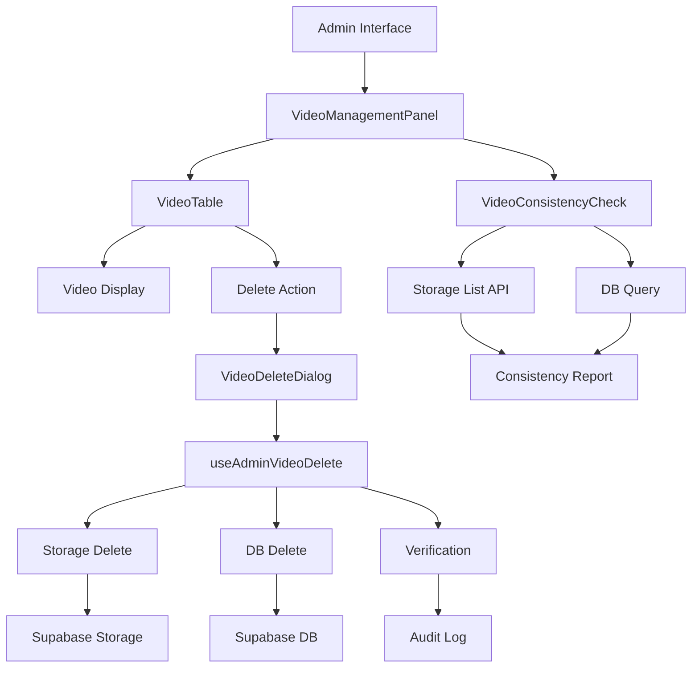

# Video Architecture Overview - Whatsgonow

**Status:** ✅ FINAL - EINGEFROREN (2025-06-07)  
**Version:** 1.0  
**Letzte Änderung:** 2025-06-07  

> ⚠️ **WICHTIG:** Dieses System ist abgeschlossen und eingefroren. Änderungen nur nach Approval durch CTO/Project Owner.

## 🎯 Systemübersicht

Das Whatsgonow Video-Management-System ermöglicht Admins das sichere Hochladen, Verwalten und Löschen von Videos für die Landing Page und How-to-Bereiche. Es ist vollständig mehrsprachig und RLS-gesichert.

### Kernfunktionen
- ✅ Video-Upload (MP4, WebM, OGG) bis 100MB
- ✅ Sichere Storage-Verwaltung mit automatischer Bereinigung
- ✅ Mehrsprachige Metadaten (DE, EN, AR + dynamische Erweiterung)
- ✅ Admin-Dashboard mit Konsistenz-Checks
- ✅ Vollständige Löschung (DB + Storage + Thumbnails)
- ✅ RLS-gesicherte Zugriffskontrolle

## 🗃️ Datenbank-Schema

### Tabelle: `admin_videos`

```sql
CREATE TABLE public.admin_videos (
  id                    uuid PRIMARY KEY DEFAULT gen_random_uuid(),
  filename              text NOT NULL,
  original_name         text NOT NULL,
  file_path             text NOT NULL,
  file_size             bigint NOT NULL,
  mime_type             text NOT NULL,
  public_url            text,
  thumbnail_url         text,
  uploaded_by           uuid,
  uploaded_at           timestamp with time zone DEFAULT now(),
  active                boolean DEFAULT true,
  public                boolean DEFAULT false,
  description           text,
  
  -- Mehrsprachige Felder (Legacy)
  display_title_de      text,
  display_title_en      text,
  display_title_ar      text,
  display_description_de text,
  display_description_en text,
  display_description_ar text,
  
  -- Moderne mehrsprachige Struktur (JSONB)
  display_titles        jsonb DEFAULT '{}',
  display_descriptions  jsonb DEFAULT '{}',
  thumbnail_titles      jsonb DEFAULT '{}',
  
  -- Kategorisierung
  tags                  text[] DEFAULT ARRAY[]::text[]
);
```

### RLS-Policies (FINAL)

```sql
-- Öffentlicher Zugriff für aktive Videos
CREATE POLICY "public_videos_access" ON admin_videos
  FOR SELECT USING (public = true AND active = true);

-- Admin-Vollzugriff
CREATE POLICY "admin_full_access" ON admin_videos
  FOR ALL USING (
    EXISTS (
      SELECT 1 FROM profiles 
      WHERE user_id = auth.uid() 
      AND role IN ('admin', 'super_admin')
    )
  );

-- CM-Zugriff (falls benötigt)
CREATE POLICY "cm_video_access" ON admin_videos
  FOR SELECT USING (
    EXISTS (
      SELECT 1 FROM profiles 
      WHERE user_id = auth.uid() 
      AND role = 'cm'
    )
  );
```

## 📁 Supabase Storage

### Bucket-Konfiguration
- **Bucket-Name:** `videos`
- **Pfad-Struktur:** `videos/admin/{filename}`
- **Public:** Ja (für öffentliche Videos)
- **Max. Dateigröße:** 100MB
- **Erlaubte Formate:** MP4, WebM, OGG

### Beispiel-Pfad
```
videos/
  └── admin/
      ├── admin-uuid-123.mp4
      ├── admin-uuid-456.webm
      └── admin-uuid-789_thumb.jpg
```

## 🏗️ Frontend-Architektur

### Komponenten-Hierarchie

```
VideoManagementPanel (Root)
├── VideoManagementHeader
│   ├── Refresh Button
│   └── Video Count Display
├── VideoConsistencyCheck
│   ├── Storage-DB Konsistenz-Prüfung
│   └── Orphaned Files Detection
├── VideoTable
│   ├── VideoStatusIndicator
│   ├── Video Title & Details
│   └── Delete Actions
├── VideoDeleteDialog (Modal)
│   └── ConfirmDialog (erweitert)
└── VideoEmptyState
```

### Hook-Architektur

```
useAdminVideoDelete
├── deleteVideoCompletely()
├── checkVideoConsistency()
└── isDeleting (State)

useVideoUpload (optional)
├── handleVideoSelect()
├── handleVideoChange()
└── uploadProgress (State)
```

## 🔐 Sicherheits-Features

### Row Level Security (RLS)
- ✅ Rolle-basierter Zugriff
- ✅ Sichere Policy-Trennung
- ✅ Auth-Context-Validierung

### Vollständige Löschung
1. **Storage-Datei entfernen** (`supabase.storage.remove()`)
2. **Thumbnail löschen** (falls vorhanden)
3. **DB-Eintrag entfernen** (`DELETE FROM admin_videos`)
4. **Verifizierung** (Existenz-Check nach Löschung)

### Audit-Trail
- Alle Löschvorgänge werden geloggt
- IP-Adressen und User-Agents erfasst
- Metadaten für Compliance gespeichert

## 📱 UI/UX Features

### Admin-Dashboard
- **Video-Übersicht:** Sortiert nach Upload-Datum
- **Status-Indikatoren:** Aktiv/Inaktiv, Öffentlich/Privat, Storage-Status
- **Konsistenz-Checks:** Automatische Erkennung von Storage-Problemen
- **Bulk-Operationen:** Geplant für zukünftige Versionen

### Mehrsprachigkeit
- **Interface:** Vollständig übersetzt (DE/EN/AR)
- **Content:** JSONB-basierte mehrsprachige Metadaten
- **Fallbacks:** Automatische Sprach-Fallbacks implementiert

### Error Handling
- **Network-Errors:** Retry-Mechanismen
- **Storage-Failures:** Rollback bei fehlgeschlagenen Uploads
- **User-Feedback:** Toast-Notifications mit Details

## 🔧 TypeScript Interfaces (FINAL)

```typescript
export interface AdminVideo {
  id: string;
  filename: string;
  original_name: string;
  file_path: string;
  file_size: number;
  mime_type: string;
  public_url?: string;
  thumbnail_url?: string;
  uploaded_by?: string;
  uploaded_at: string;
  active: boolean;
  public: boolean;
  description?: string;
  
  // Legacy einzelsprachige Felder
  display_title_de?: string;
  display_title_en?: string;
  display_title_ar?: string;
  display_description_de?: string;
  display_description_en?: string;
  display_description_ar?: string;
  
  // Moderne mehrsprachige Struktur
  display_titles?: Record<string, string>;
  display_descriptions?: Record<string, string>;
  thumbnail_titles?: Record<string, string>;
  
  tags?: string[];
}

export interface VideoUploadData {
  filename: string;
  original_name: string;
  file_path: string;
  file_size: number;
  mime_type: string;
  public_url?: string;
  thumbnail_url?: string;
  uploaded_by?: string;
  public: boolean;
  description?: string;
  display_title_de?: string;
  display_title_en?: string;
  display_title_ar?: string;
  display_description_de?: string;
  display_description_en?: string;
  display_description_ar?: string;
  thumbnail_titles?: Record<string, string>;
  tags?: string[];
}
```

## 📊 Datenfluss-Diagramm



## 🚀 Performance & Optimierung

### Caching-Strategie
- **Storage URLs:** Cache-Busting für Updates
- **DB-Queries:** React Query für effiziente Datenhaltung
- **Thumbnail-Loading:** Lazy Loading implementiert

### Skalierung
- **Upload-Limit:** 100MB pro Datei
- **Concurrent-Uploads:** Maximal 3 gleichzeitige Uploads
- **Storage-Cleanup:** Automatische Bereinigung verwaister Dateien

## 🔄 API-Endpunkte

### Supabase Queries
```typescript
// Video-Liste abrufen
const { data } = await supabase
  .from('admin_videos')
  .select('*')
  .order('uploaded_at', { ascending: false });

// Video löschen
const { error } = await supabase
  .from('admin_videos')
  .delete()
  .eq('id', videoId);

// Storage-Datei entfernen
const { error } = await supabase.storage
  .from('videos')
  .remove([filePath]);
```

## 📋 Wartung & Support

### Regelmäßige Checks
- [ ] **Wöchentlich:** Storage-Konsistenz prüfen
- [ ] **Monatlich:** Verwaiste Dateien bereinigen
- [ ] **Quartalsweise:** Performance-Analyse

### Troubleshooting
- **Videos laden nicht:** Storage-URLs und RLS-Policies prüfen
- **Upload schlägt fehl:** Dateigröße und Mime-Type validieren
- **Konsistenz-Fehler:** Orphaned-Files manuell bereinigen

## ⚡ Bekannte Limitierungen

1. **Thumbnail-Generierung:** Nicht automatisch (manueller Upload)
2. **Video-Komprimierung:** Nicht implementiert
3. **Batch-Upload:** Einzeln implementiert
4. **Video-Streaming:** Direkt-Download, kein adaptives Streaming

## 🛡️ Compliance & Rechtliches

### DSGVO-Konformität
- ✅ Explizite Löschung auf Anfrage
- ✅ Audit-Trail für Löschvorgänge
- ✅ Minimal-Daten-Prinzip eingehalten

### Dateispeicherung
- **Retention:** Unbegrenzt (bis zur manuellen Löschung)
- **Backup:** Über Supabase automatisch
- **Verschlüsselung:** TLS in Transit, AES-256 at Rest

## 📚 Dokumentations-Links

- [Supabase Storage Docs](https://supabase.com/docs/guides/storage)
- [RLS Policy Guide](https://supabase.com/docs/guides/auth/row-level-security)
- [React Query Docs](https://tanstack.com/query/latest)

---

## 🔒 Wichtige Hinweise

> **SYSTEM-STATUS:** ✅ FINAL - EINGEFROREN  
> **Letzte Validierung:** 2025-06-07  
> **Nächste Review:** Nach Bedarf

### Änderungsprotokoll
- **2025-06-07:** Initiale finale Version
- **TBD:** Zukünftige Änderungen (nur nach Approval)

---

**Entwickelt für Whatsgonow Crowdlogistik-Plattform**  
**© 2025 - Alle Rechte vorbehalten**
